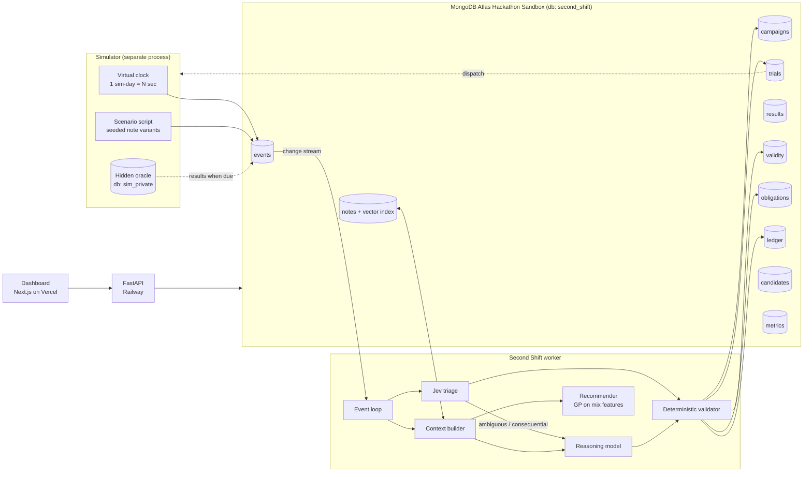
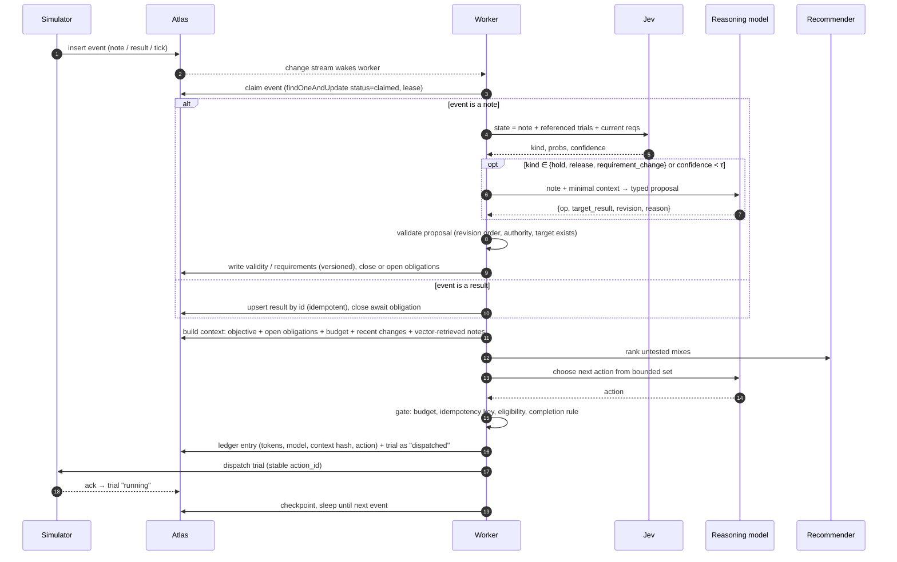
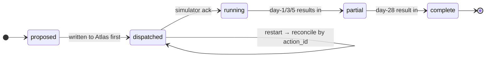
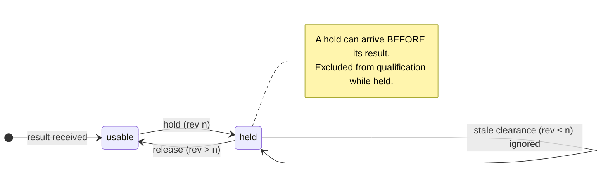
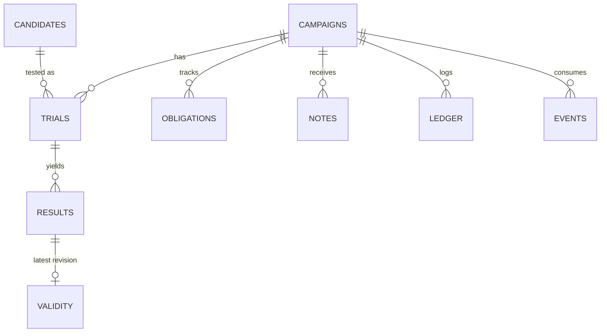

# Second Shift — Build Plan

**MongoDB × Cerebral Valley: Harness Engineering & Model Wrangling Hackathon, NYC, Sept 26 2026**
**Track: Problem Statement 2, Long Horizon Engineering**

> *Every AI data center is poured in concrete, and cement is roughly 6–8% of the world's CO₂. Meta proved AI can design better mixes. But each test takes 28 days, results get put on hold, and specs change mid-campaign. **Second Shift is the agent that runs that month-long campaign to the finish without faking its progress.***

---

## 1. What we are building (one paragraph)

Second Shift is a long-running agent harness that carries one experimental campaign to a verified result:

> *Find the lowest-carbon mix that reaches ≥ 3,000 psi at day 1 and ≥ 8,000 psi at day 28, using at most 8 trials.*

Trial results arrive on a simulated clock over 28+ days. Messy lab notes put results on hold, release them, change the requirements, and arrive out of order. The worker gets killed mid-campaign. The agent has to rebuild its state from MongoDB, never double-spend a trial, never count invalid or early evidence as success, and keep spending its remaining budget intelligently until the objective is **verified** or the budget is honestly reported as insufficient.

**Jev** triages every incoming note cheaply. **A reasoning model** handles only what Jev flags as consequential. **A numerical recommender** ranks mixes. **MongoDB Atlas** holds the whole mission.

### Why this fits Statement 2

| Statement 2 asks for | Where it shows up |
|---|---|
| Work that spans days or weeks | A 28-day curing cycle per trial; the campaign runs ~40 simulated days |
| Coherent memory across the session | Mission state lives in Atlas; the model context is rebuilt every step and thrown away |
| Relentlessly optimizes toward long-term goals | Budgeted search for minimum GWP, continuing after setbacks |
| Learns from hard metric signals | Real published strength measurements, revealed only when "cured" |
| Traditionally difficult tasks | Delayed feedback, invalidated evidence, out-of-order events, restarts |

### What it is NOT
- Not a concrete-recipe chatbot, not an "AI scientist," not a generic memory layer.
- Not a policy-rewriting agent (that's Statement 1).
- Not inventing new mixes. It chooses among 65 published mixes whose outcomes stay hidden until due.

---

## 2. Hard requirements (from the organizer guide)

- [ ] **Everything runs on the MongoDB Atlas Hackathon Sandbox.** Create the project and cluster through the emailed invite link. A normal Atlas account disqualifies us as finalists.
- [ ] MongoDB is the data and memory layer.
- [ ] All work is original and built today.
- [ ] **Public GitHub repo.**
- [ ] **1-minute demo video** with working audio, showing the code and functionality built today.
- [ ] Short project description, submitted on the Cerebral Valley platform, **with both teammates added**.
- [ ] At least one of us at **MongoDB.local NYC, Pier 36, Sept 30, 10:00–4:30** if we're a finalist.

**Partner credits (codes from 10:30 after check-in):**
- OpenRouter: reasoning model plus Jev as `typesafe/jev-1.13`
- Voyage AI: 200M tokens of embeddings
- Vercel v0: $30, dashboard plus public URL
- LangSmith: tracing (optional)

---

## 3. The data (real) vs. the scenario (synthetic)

**Real:** Meta's open-source BOxCrete dataset, `facebookresearch/SustainableConcrete/data/boxcrete_data.csv` (MIT; cite the BOxCrete paper, arXiv 2603.21525).
- 149 mixes, 145 with both day-1 and day-28 results. Columns include composition, **GWP**, and mean strength at days 1, 3, 5, (14), 28.
- **We use Material Source 0: 65 mixes** (mortar records). One consistent source; we never mix sources.

**The objective, checked against the data:**

| Fact (source 0) | Value |
|---|---|
| Mixes meeting both strength targets | 21 |
| …that also have GWP ≤ 240 (the "win" set) | **4** |
| Lowest GWP among strength-passing mixes | 200.1 |
| "Traps": ≥ 3,000 psi at day 1 but < 8,000 at day 28 | **9** |
| Blind picking with 8 trials hits a winner | ~42% (computed) |

The traps are what make this long-horizon for real: the early leader is often not the final winner. Example from the spike: M6 leads at day 1 (6,279 psi), but M1 wins at day 28.

**Synthetic, and labeled that way everywhere:**
- the budget, the virtual clock, lab notes, quality holds, requirement changes, delivery order
- the thresholds (a software objective, not a construction spec)

Putting a result "on hold" means withholding it from the campaign. It never alters or questions the published measurement.

---

## 4. Architecture



**Key boundary:** hidden outcomes live in a **separate database (`sim_private`)**, and the worker's Atlas user has **no read role on it**. MongoDB access control, not an honor system, stops the agent from peeking. Say this in the demo.

### Responsibilities

| Component | Does | Never does |
|---|---|---|
| **MongoDB Atlas** | Holds the mission: objective, trials, results, validity, obligations, notes, ledger, metrics | — |
| **Deterministic code** | Budget, idempotency, revision ordering, qualification check, due-work queries | Interpret free text |
| **Jev** (`typesafe/jev-1.13`) | Classifies every note; yes/no checks on scope and supersession | Arithmetic, dates, planning, deciding success |
| **Reasoning model** (OpenRouter) | Turns flagged notes into typed change proposals; plans budget use (batch now vs. wait for day-28 info) | Compute strength or GWP; mark anything verified |
| **Recommender** | Ranks untested mixes by predicted day-28 strength ± uncertainty and GWP | Talk |
| **Vector Search** (Voyage embeddings) | Pulls prior notes relevant to the current decision | Stand in for the obligation list (open work is always a plain query) |
| **Evaluator** | Scores runs against the hidden oracle | Feed anything back to the agent |

---

## 5. The worker loop



**Bounded action set:**
`schedule_trial(mix, action_id)` · `wait_for_results` · `request_clarification(note_id)` · `mark_blocked(reason)` · `propose_completion(mix)`

`propose_completion` passes the gate only if **valid, non-held day-1 and day-28 results** meet the **current** requirement version. Otherwise it's rejected and logged as an attempted false completion.

**Restart safety:**
- Every trial is written with a stable `action_id` **before** dispatch.
- On boot, the worker reconciles any `dispatched` trial with no ack by asking the simulator for that `action_id`'s status.
- It never re-dispatches blindly.
- Leases on claimed events expire, so a crashed claim gets retried, and results upsert by id, so retries are safe.

---

## 6. State machines





---

## 7. MongoDB data model (db `second_shift`)



| Collection | Key fields | Notes |
|---|---|---|
| `campaigns` | `_id, system, seed, objective{d1_min,d28_min,gwp_max,optimize:"min_gwp"}, requirement_version, budget, spent, sim_day, status, best_verified{mix,gwp,day}` | `system` ∈ `second_shift`, `baseline_summary`, `baseline_script` |
| `candidates` | `mix_id, source, cement, fly_ash, slag, water, hrwr, fine_agg, coarse_agg, gwp` | **No strength fields.** Seeded from CSV |
| `trials` | `_id = action_id, campaign_id, mix_id, status, start_day, req_version_at_start` | `_id` is the idempotency key |
| `results` | `_id = "{action_id}:age:{d}", campaign_id, mix_id, age, psi, received_day` | Upsert-only |
| `validity` | `result_id, revision, valid, reason, note_id` | Highest revision wins |
| `obligations` | `campaign_id, kind, ref, due_day, status` | `kind` ∈ `await_result`, `resolve_hold`, `confirm_dispatch`, `recheck_requirements` |
| `notes` | `campaign_id, sim_day, text, embedding, jev{kind,probs,confidence}, routed_to_llm, proposal` | Atlas Vector Search index on `embedding` |
| `events` | `campaign_id, sim_day, type, payload, status, lease_until` | Queue; the change stream wakes the worker |
| `ledger` | `campaign_id, step, sim_day, model, tokens_in, tokens_out, cost_usd, context_hash, context_card, action, rationale` | Every model call; drives the cost panel |
| `metrics` | per-run aggregates | Written by the evaluator |

`sim_private.oracle`: `{mix_id, strength{1,3,5,28}}`, readable **only** by the simulator's DB user.

**Indexes:**
- `obligations {campaign_id:1, status:1, due_day:1}`
- `events {status:1, sim_day:1}`
- `results {campaign_id:1, mix_id:1}`
- `validity {result_id:1, revision:-1}`
- vector index on `notes.embedding`

---

## 8. Jev spec

One call per note, all questions answered in a single pass.

```json
{
  "model": "jev-1.13.0",
  "state": {
    "note": "<raw lab note>",
    "open_trials": [{"action_id": "t-3", "mix": "M9", "ages_received": [1,3]}],
    "requirements": {"version": 2, "summary": "d1>=3000, d28>=8000, minimize GWP"}
  },
  "questions": {
    "kind": {
      "type": "choice",
      "instructions": "What does this note do to the campaign?",
      "criteria": {
        "quality_hold": "Says a specific result or batch should not be trusted/used for now",
        "hold_released": "Says a previously held result is cleared for use",
        "requirement_change": "Changes what counts as success or which mixes are allowed",
        "measurement_report": "Reports a test result or its timing",
        "logistics": "Scheduling, staffing, equipment, no effect on validity or requirements",
        "ack_only": "Acknowledges something without new information",
        "ambiguous": "Cannot tell which of the above from the note alone"
      }
    },
    "refers_to_open_trial": {"type": "noul", "instructions": "Does the note clearly identify one of the open trials?"},
    "claims_to_supersede": {"type": "noul", "instructions": "Does the note say it replaces or reverses an earlier instruction?"}
  }
}
```

**Routing:**
- `logistics` or `ack_only` with confidence ≥ τ: log it only. No reasoning-model call.
- `quality_hold`, `hold_released`, `requirement_change`, `ambiguous`, or confidence < τ: send to the reasoning model for a typed proposal, then the deterministic validator.
- τ gets tuned on the dev note set (hour 5), **not** assumed.

**Swappable:** `classify_note()` has three backends: `jev`, `llm_structured`, `rules`. The same run can use any of them, so we can show what Jev buys (cost per note, and accuracy against our labeled notes).

**Cost claim we can back:** Jev lists at $0.042 per 1M input tokens with free output. Show real per-note cost from the `ledger`. Don't extrapolate to "billions" unless we run it.

---

## 9. Context builder: "what the model saw"

Every reasoning call gets a **context card** of about 4–6k tokens, rebuilt from Atlas and saved in `ledger.context_card`:

1. Objective + requirement version, with a one-line changelog
2. Budget: spent / remaining, plus sim day
3. **Open obligations** (deterministic query, all of them)
4. Trials table: mix, status, received ages, validity
5. Current best **verified** result, or "none"
6. Changes since the last step
7. Recommender top-5 untested: predicted d28 ± σ, GWP
8. Up to 3 vector-retrieved prior notes relevant to the step

The dashboard shows this card for every step, so judges can see memory coming from the database, not a growing chat log.

---

## 10. The demo scenario (seeded, replayable)

| Sim day | Event | Required behavior |
|---|---|---|
| 0 | Campaign starts: 8-trial budget | Agent schedules a first batch (e.g. 4) from recommender + GWP |
| 1 | Day-1 results | A **trap** mix looks great. Agent does **not** declare success; opens `await_result` for d28 |
| 3 | Note: *"cylinders from Tuesday's pour for the low-slag one were cured in the wrong room, hold those numbers until QA looks"* | Jev → `quality_hold`; LLM maps it to the right trial; validity rev 2 = held |
| 4 | **Kill the worker** after a trial is written `dispatched` but before the ack | On restart: reconcile by `action_id`, no double spend, same next due work |
| 6 | Note: *"sustainability wants anything with fly ash from supplier B out"* | `requirement_change` → version 3; pending trials re-checked; a scheduled mix may become ineligible |
| 7 | **Stale** note: *"QA cleared the Tuesday cylinders"* (from before the hold, rev 1) | Ignored; hold stands; logged as superseded |
| 8–10 | Agent spends remaining budget | Recommender plus the updated picture of valid evidence |
| 28+ | Day-28 results roll in | The trap fails d28. **"Best verified" moves only on valid evidence** and can go *down* |
| ~30 | QA properly releases (rev 3) or not, per seed | Qualification recomputed |
| ~38 | End | `propose_completion` with valid evidence, **or** honest "budget insufficient" |

**Seeds:** 5 wording variants per note type and 3 event orderings, i.e. 15 runs per system.

**Dev/test split:** tune on seeds 1–5; report on seeds 6–15, which nobody looks at while tuning.

**Hour-1 task:** pick which mix the hold hits and which supplier the requirement change excludes, **from the data**, so both actually bite (the hold hits a real contender; the exclusion removes a real candidate).

---

## 11. Proving it: baselines and metrics

Same seeds, same data, same budget, same recommender, same reasoning model:

| System | Memory | Note handling |
|---|---|---|
| **A. Scripted** | Perfect structured state | Ignores free-text notes (only sees results) |
| **B. Rolling-summary agent** | LangGraph-style checkpoint + rolling summary of history | LLM reads notes in the chat history |
| **C. Second Shift** | Explicit obligations, versioned validity, action ledger, rebuilt context | Jev triage → LLM → validator |

| Metric | Why |
|---|---|
| **Verified success**: found a win-set mix with valid evidence | The actual goal |
| **Best valid GWP found** | The optimization target |
| **False completions**: done on held, early, stale, or excluded evidence | The honesty test |
| **Double-spent trials** after restart | Continuity |
| **Missed obligations**: a held result never revisited, an ack never reconciled | Long-horizon memory |
| **Trials used, sim days to finish** | Efficiency |
| **Tokens and $: reasoning vs. Jev, per note and per run** | Cost of the harness |

If B ties C on something, **report the tie**. Never weaken a baseline to win.

---

## 12. Dashboard (three panels, one page)

```
┌──────────────────────────────────────────────────────────────────────────────┐
│ SECOND SHIFT  · campaign #12 · sim day 28 · budget 6/8 · req v3 · [Kill][Run]│
├────────────────────────┬──────────────────────────────┬──────────────────────┤
│ OBJECTIVE & PROGRESS   │ TIMELINE                     │ PROOF                │
│ d1≥3000 d28≥8000 minGWP│ d1  results: M6 6279 ↑trap   │ A  B  C  (15 seeds)  │
│                        │ d3  NOTE → Jev: quality_hold │ success   ..  ..  .. │
│ Best VERIFIED GWP      │     → LLM: hold t-3 rev2     │ false done..  ..  .. │
│  ▁▂▃▅▅▅▃▃▅▆  (can drop)│ d4  ✖ worker killed          │ dbl spend ..  ..  .. │
│                        │     ↻ restored, reconciled   │ tokens    ..  ..  .. │
│ OPEN OBLIGATIONS (7)   │ d6  NOTE → requirement v3    │ $ / run   ..  ..  .. │
│  await d28  t-1,t-2,.. │ d7  NOTE stale rev1 ignored  │                      │
│  resolve_hold t-3      │ ...                          │ Jev $/note  0.00000x │
│                        │ [click step → context card]  │                      │
└────────────────────────┴──────────────────────────────┴──────────────────────┘
```

Built with v0 (Next.js), reading through the FastAPI service. The **Kill** button really stops the worker process; restarting is the demo.

---

## 13. Repo layout

```
second-shift/
  data/                 boxcrete_data.csv, THIRD_PARTY_LICENSE.txt, CITATION
  sim/                  oracle loader, virtual clock, scenario scripts, note variants, dispatch/ack API
  harness/
    store.py            Atlas access, indexes, change stream (poll fallback)
    loop.py             event claim → triage → validate → plan → gate → persist
    context.py          context card builder
    jev.py              classify_note() backends: jev | llm_structured | rules
    llm.py              OpenRouter client, typed proposals, action choice
    recommender.py      GP (sklearn) over composition features → d28 ± σ
    gate.py             budget, idempotency, revision order, completion rule
  baselines/            scripted.py, rolling_summary.py
  eval/                 run_matrix.py (systems × seeds), metrics.py
  api/                  FastAPI: campaigns, timeline, context cards, kill/restart, run
  web/                  v0 Next.js dashboard
  tests/                ported spike tests (12) + restart/reconcile + gate tests
  .env.example          MONGODB_URI (sandbox), OPENROUTER_API_KEY, TYPESAFE_API_KEY, VOYAGE_API_KEY
```

**Starting point:** the feasibility spike (`second_shift_feasibility_spike.zip`), whose 12 passing state tests port straight into `tests/`. Its 12-mix / 6-trial setup is **too easy**: exactly 6 mixes fit its cement cap, so any script finds the single winner. That's why we switch to the full source-0 pool and the GWP objective.

---

## 14. Timeline and split (H0 = start of build)


- **Milestone 1 (~H3.5), non-negotiable before anything else:** the apparent winner gets held → worker killed → restart → no double spend → agent keeps spending budget on valid evidence.
- **Milestone 2 (~H6):** Jev routing live, requirement change and stale-note handling pass.
- **Milestone 3 (~H8):** 15-seed matrix for A/B/C; numbers on the dashboard.
- **H9: feature freeze.** Only video, README, submission after this.

---

## 15. The 60-second video

| Time | Show | Say (roughly) |
|---|---|---|
| 0–8s | Data center photo → cement CO₂ stat | "Cement is ~8% of global CO₂. Every AI data center is poured in it." |
| 8–18s | Objective panel | "Meta open-sourced real lab data. Our agent has 8 trials to find the lowest-carbon mix that's actually strong at 28 days." |
| 18–32s | Timeline: trap at day 1, hold note, Jev label, **Kill** → restore | "Results take weeks, get put on hold, arrive out of order. We kill it mid-campaign. It comes back from MongoDB, spends nothing twice." |
| 32–45s | "Best verified" line drops, then recovers; open-obligations list | "It refuses to count evidence it can't trust, even when its score goes down." |
| 45–55s | Proof table A/B/C + Jev $/note; quick flash of code + Atlas collections | "Same model, same budget: fewer false 'done' calls, zero double spends. Jev triages every note for fractions of a cent." |
| 55–60s | Logo + repo URL | "Second Shift. It keeps working until the outcome is verified." |

Fill in the proof numbers **from the real eval run**. Placeholders never ship.

---

## 16. Risks and fallbacks

| Risk | Fallback |
|---|---|
| Jev call format through OpenRouter differs from the TypeSafe API | Call TypeSafe directly (`api.typesafe.ai/v1/systemone`); else the `llm_structured` backend. **Test one call in H1.** |
| OpenRouter credits don't cover Jev | Same as above; say so in the README |
| Change streams unavailable on the sandbox tier | Poll `events` every 1s; the design stays the same |
| GP recommender takes too long | Nearest-neighbor predicted d28 + GWP sort |
| Baseline B ties C | Report it; lead with false completions and double-spends, which the explicit ledger targets |
| Vercel deploy fights us | Run the dashboard locally for the video; the repo + video are what's required |
| Scope creep | Anything not in milestones 1–3 waits until after submission |

---

## 17. Claims we will and won't make

**Will:**
- "Real published measurements, hidden until due."
- "Hidden outcomes enforced by Atlas access control."
- "Measured on N held-out seeds."
- "Real token and cost counts."

**Won't:**
- "Billions of tokens" (unless actually run and counted)
- "Weeks of runtime" (it's a compressed simulated clock)
- "Discovered a new concrete"
- "Beats BOxCrete / BayBE"
- Any percentage we didn't measure

**Nearest existing work:**
- BOxCrete: mix optimization
- BayBE: persisted experimental campaigns
- Medra: AI experimentalist
- RealityLoop: lab memory and provenance
- LangGraph: checkpointing

Our claim is narrower: **correct completion of a long campaign under invalidated evidence, out-of-order events, and restarts**, measured against a fair baseline.

---

## 18. Submission checklist

- [ ] Built on the emailed Atlas Hackathon Sandbox cluster
- [ ] Repo public; README has the pitch, architecture diagram, how to run, data attribution (MIT + BOxCrete citation), and the synthetic-vs-real statement
- [ ] 60s video with audio: code visible, functionality visible, real numbers
- [ ] Description (≤ 3 sentences) on Cerebral Valley
- [ ] Both teammates added to the submission
- [ ] Demo link opens in an incognito window
- [ ] Someone confirmed for MongoDB.local NYC, Sept 30, 10:00–4:30
