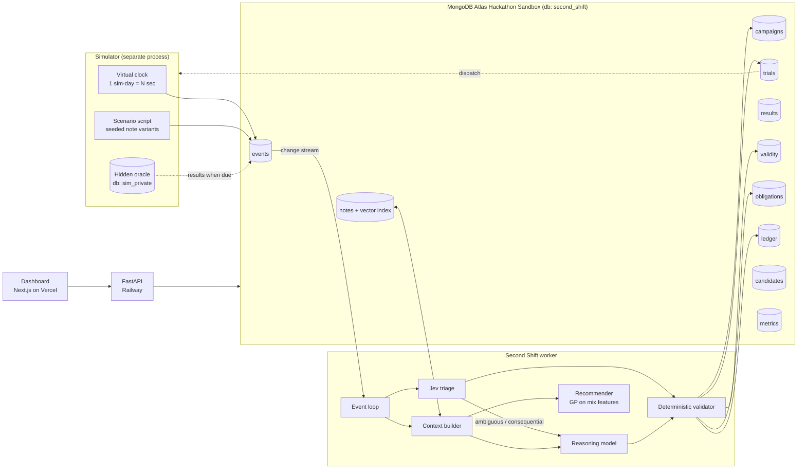
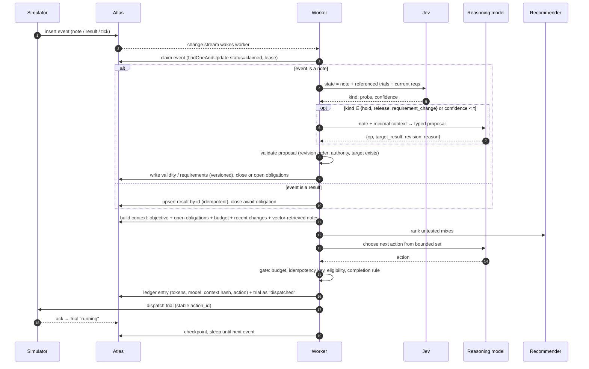
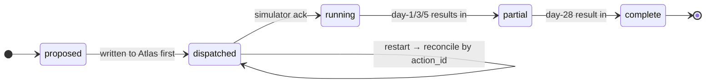
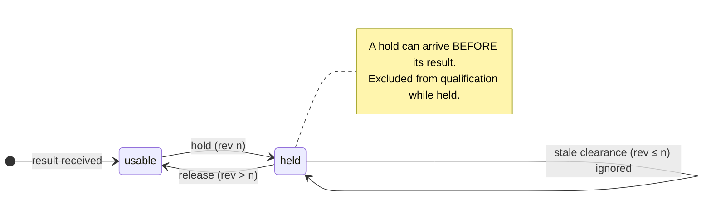
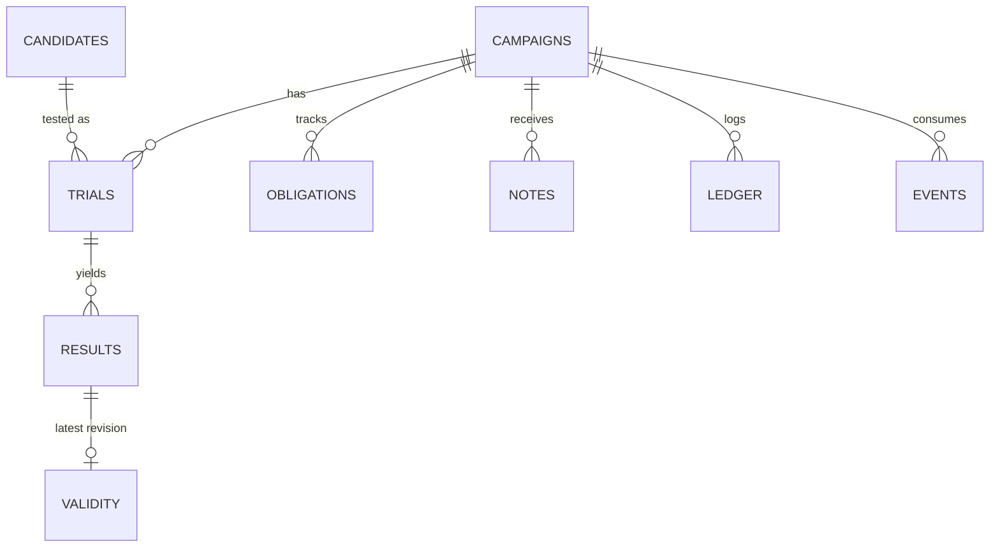

# Second Shift — Build Plan

**MongoDB × Cerebral Valley: Harness Engineering & Model Wrangling Hackathon, NYC, Sept 26 2026**
**Track: Problem Statement 2, Long Horizon Engineering**

> *Every AI data center is poured in concrete, and cement is roughly 6–8% of the world's CO₂. Meta proved AI can design better mixes. But each test takes 28 days, results get put on hold, and specs change mid-campaign. **Second Shift is the agent that runs that month-long campaign to the finish without faking its progress.***

---

## 1. What we are building (one paragraph)

Second Shift is a long-running agent harness that carries one experimental campaign to a verified result:

> *Find the lowest-carbon mix that reaches ≥ 3,000 psi at day 1 and ≥ 8,000 psi at day 28, using at most 8 trials.*

Trial results arrive on a simulated clock over 28+ days. Messy lab notes put results on hold, release them, change the requirements, and arrive out of order. The worker gets killed mid-campaign. The agent has to rebuild its state from MongoDB, never double-spend a trial, never count invalid or early evidence as success, and keep spending its remaining budget intelligently until the objective is **verified** or the budget is honestly reported as insufficient.

**Jev** triages every incoming note cheaply. **A reasoning model** handles only what Jev flags as consequential. **A numerical recommender** ranks mixes. **MongoDB Atlas** holds the whole mission.

### Why this fits Statement 2

| Statement 2 asks for | Where it shows up |
|---|---|
| Work that spans days or weeks | A 28-day curing cycle per trial; the campaign runs ~40 simulated days |
| Coherent memory across the session | Mission state lives in Atlas; the model context is rebuilt every step and thrown away |
| Relentlessly optimizes toward long-term goals | Budgeted search for minimum GWP, continuing after setbacks |
| Learns from hard metric signals | Real published strength measurements, revealed only when "cured" |
| Traditionally difficult tasks | Delayed feedback, invalidated evidence, out-of-order events, restarts |

### What it is NOT
- Not a concrete-recipe chatbot, not an "AI scientist," not a generic memory layer.
- Not a policy-rewriting agent (that's Statement 1).
- Not inventing new mixes. It chooses among 65 published mixes whose outcomes stay hidden until due.

---

## 2. Hard requirements (from the organizer guide)

- [ ] **Everything runs on the MongoDB Atlas Hackathon Sandbox.** Create the project and cluster through the emailed invite link. A normal Atlas account disqualifies us as finalists.
- [ ] MongoDB is the data and memory layer.
- [ ] All work is original and built today.
- [ ] **Public GitHub repo.**
- [ ] **1-minute demo video** with working audio, showing the code and functionality built today.
- [ ] Short project description, submitted on the Cerebral Valley platform, **with both teammates added**.
- [ ] At least one of us at **MongoDB.local NYC, Pier 36, Sept 30, 10:00–4:30** if we're a finalist.

- [ ] **Record the demo video on site today** (the guide says "Record an on-site demo Sept 26").
- [ ] **Ask in the event Discord for the submission deadline.** The guide lists "Submissions due" with **no time**, and the live doc has none either. Plan backwards from whatever they say, not from "10 hours."

### Credits: what each one is, where to redeem it, and whether we need it

| Partner | What | How to redeem | Need it? |
|---|---|---|---|
| **OpenRouter** | **$10 per person** (Notion page) | Sign in at openrouter.ai → open `openrouter.ai/c/MONGODB-OR-FCVGBH` → check that $10 shows at openrouter.ai/credits. **Code expires Oct 1.** | **Yes, both of us.** Pays for the reasoning model *and* Jev. $20 total for the team |
| **Vercel v0** | $30 of v0 credits | v0.app → profile → Credits → **Redeem Code** (the "Redeem a Usage Code" button on `v0.app/andrewshatsky/settings/billing`). Code arrives by email at 10:30 | **Yes, whoever builds the dashboard** |
| **Voyage AI** | 200M tokens | dashboard.voyageai.com → API key. **Add a payment method** to get Tier 1 rate limits (not charged within the free allowance) | Only if Automated Embedding doesn't work on the sandbox. Set it up anyway in case |
| **LangSmith** | $50 + Deployments | Airtable form in the guide, within 10 days; needs a card on file to show credits (not charged) | Optional, tracing only. The free tier covers a day of traces |
| **OpenAI Codex** | 1,250 Codex credits | Code by email from 10:30 | Optional coding assistant. Not used by the product |
| **ElevenLabs** | 1 month Creator | Event Discord bot | No |
| **Kiro** | 50/mo + 500 bonus credits | kiro.dev sign-in | No |

### Model budget ($20 of OpenRouter for the team)

Jev is essentially free at this scale ($0.042 per 1M input tokens). **The reasoning model is the whole budget.**
- **Set a credit limit on each OpenRouter API key** (e.g. $8) so a runaway loop can't drain the account.
- **Use the strong model only for the recorded demo run.** Run the 15-seed × 2-LLM-system eval matrix on the cheap model. Baseline A is a script and costs $0.
- **Keep the context card ≤ 6k tokens**, which also caps cost per step.
- **Before launching the matrix:** read per-run cost from the `ledger` of one run, multiply it out, and cut seeds if it doesn't fit.
- **The spend is itself a demo metric:** "$X for Y campaigns, Z% of notes never touched the expensive model."

---

## 3. The data (real) vs. the scenario (synthetic)

**Real:** Meta's open-source BOxCrete dataset, `facebookresearch/SustainableConcrete/data/boxcrete_data.csv` (MIT; cite the BOxCrete paper, arXiv 2603.21525).
- 149 mixes, 145 with both day-1 and day-28 results. Columns include composition, **GWP**, and mean strength at days 1, 3, 5, (14), 28.
- **Candidate pool: Material Source 0, cured at 22 °C → 58 mixes** (mortar records). One consistent source.
  - The 7 source-0 rows cured at 4.5 °C are the *same recipes* cured cold. We drop them from the pool.
  - They stay in the story: they are the real evidence behind the demo's quality hold (see below).

**The objective, checked against the data:**

| Fact (58-mix pool) | Value |
|---|---|
| Mixes meeting both strength targets | 21 |
| …that also have GWP ≤ 240 (the **win set**) | **4: M19 (200.1), M31 (236.3), M9 (237.5), M22 (239.7)** |
| "Traps": ≥ 3,000 psi at day 1 but < 8,000 at day 28 | **9** |
| Blind picking with 8 trials hits a winner | ~46% (computed) |

**The two nastiest traps are also the two lowest-carbon "passers" at day 1:**

| Mix | GWP | Day 1 | Day 28 |
|---|---|---|---|
| M4 | 194.0 | 3,115 ✓ | 4,433 ✗ |
| M2 | 209.2 | 3,440 ✓ | 6,222 ✗ |

An agent that trusts early results "wins" with M4 at day 1 and is wrong. That's the long-horizon test, straight from real data.

### The two scripted disruptions (decided)

**1. Quality hold → M19, the best winner (GWP 200.1).**
- **Trigger:** the day after M19's day-28 result arrives. That's the moment it has just become "best verified."
- **Note:** *"heads up — M19's cylinders may have sat in the cold room over the weekend, don't use those numbers until QA re-checks."*
- **Grounded in the real data:** the same recipe cured at 4.5 °C (M35) hit only **224 psi at day 1 vs. 3,105** at 22 °C. Cold curing really does wreck these results.
- **If the agent never tests M19,** the hold hits the first win-set mix it verifies instead, so the hold always lands on something that matters. The README will state this adaptive rule openly.
- **The "best verified" line visibly drops.** The agent must find another winner with its remaining budget.
- **Default ending:** the hold is **not** released inside the campaign window. Seed variants release it (rev 3) late, to test that the agent re-qualifies M19 correctly.

**2. Requirement change → slag cap of 320 kg/m³, announced on sim day 6.**
- **Note:** *"slag supplier says they can't do more than 320 per m³ on our orders going forward."*
- **It removes exactly one winner: M31** (slag 352.1, the *strongest* winner at 11,357 psi day 28). Any in-flight M31 trial stops counting toward success.
- **It removes 9 mixes in all** (M14, M31, M51, M58, M61, M62, M64, M65, M66), shrinking the pool to 49. Several are low-GWP high-slag mixes, so the recommender's map shifts too.

**After both disruptions, only M9 (237.5) and M22 (239.7) can still win.** Blind 8-trial odds drop to ~30%. The correct final answer is **M9** (M19 if its hold is released).

**Stale clearance:** on the day after the hold, a revision-1 note arrives: *"QA signed off on last week's cylinders."* It was written before the hold and must be ignored.

**Synthetic, and labeled that way everywhere:**
- the budget, the virtual clock, lab notes, quality holds, requirement changes, delivery order
- the thresholds (a software objective, not a construction spec)

Putting a result "on hold" means withholding it from the campaign. It never alters or questions the published measurement.

---

## 4. Architecture



**Key boundary:** hidden outcomes live in a **separate database (`sim_private`)**, and the worker's Atlas user has **no read role on it**. MongoDB access control, not an honor system, stops the agent from peeking. Say this in the demo.

### Responsibilities

| Component | Does | Never does |
|---|---|---|
| **MongoDB Atlas** | Holds the mission: objective, trials, results, validity, obligations, notes, ledger, metrics | — |
| **Deterministic code** | Budget, idempotency, revision ordering, qualification check, due-work queries | Interpret free text |
| **Jev** (`typesafe/jev-1.13`) | Classifies every note; yes/no checks on scope and supersession | Arithmetic, dates, planning, deciding success |
| **Reasoning model** (OpenRouter) | Turns flagged notes into typed change proposals; plans budget use (batch now vs. wait for day-28 info) | Compute strength or GWP; mark anything verified |
| **Recommender** | Ranks untested mixes by predicted day-28 strength ± uncertainty and GWP | Talk |
| **Vector Search** (Voyage embeddings) | Pulls prior notes relevant to the current decision | Stand in for the obligation list (open work is always a plain query) |
| **Evaluator** | Scores runs against the hidden oracle | Feed anything back to the agent |

---

## 4b. Tech stack (chosen from the organizer guide)

Everything below is either linked from the guide or paid for by its partner credits, except Jev, which we reach through the event's OpenRouter credits.

| Layer | Choice | Why | Fallback |
|---|---|---|---|
| **Database** | **MongoDB Atlas Hackathon Sandbox**, `pymongo` | Required for finalists | none, this is mandatory |
| **Run state** | **LangGraph** + `langgraph-checkpoint-mongodb` (`MongoDBSaver`) | The guide's *"Build an AI Agent with LangGraph and MongoDB Atlas"* | plain `checkpoints` collection |
| **Mission memory** | Our own collections (§7): obligations, validity, ledger… | *State & Persistence* post, Pattern 4: keep state and memory separate | none |
| **Semantic memory** | **Atlas Vector Search** on `notes`, via **Automated Embedding** (`voyage-4-lite`) | Guide: Vector Search + Automated Embeddings. No embedding pipeline to build | Automated Embedding is *public preview* and may not be on the sandbox tier. Fall back to the `voyageai` client (200M free tokens) + our own `$vectorSearch` index |
| **Jev** | `typesafe-sdk` with `base_url="https://openrouter.ai/api"`, key = `OPENROUTER_API_KEY`, `model="jev-1.13"` | Paid by event OpenRouter credits; $0.042/1M input, output free | Raw `requests.post` to `https://openrouter.ai/api/v1/systemone` with the same JSON → then the `llm_structured` backend |
| **Reasoning model** | OpenRouter via `langchain-openai` `ChatOpenAI(base_url="https://openrouter.ai/api/v1")`. Claude Sonnet for planning, Claude Haiku for eval-matrix volume. **Confirm exact model ids on openrouter.ai** | Event OpenRouter credits | Any OpenRouter model with tool calling |
| **Recommender** | `scikit-learn` `GaussianProcessRegressor` on composition features → d1, d28 ± σ | Fast to build | nearest-neighbour + GWP sort. (BOxCrete itself uses BoTorch/Ax; optional stretch) |
| **Tracing** | **LangSmith** (`LANGSMITH_TRACING=true`) | Guide credits; free trace viewer for debugging and the video | skip |
| **Worker + control API** | Python 3.12, **FastAPI** inside the worker process. `/kill` does a real `SIGKILL` on itself | Real crash, not a pause | — |
| **Worker hosting** | **Railway** with restart-on-failure (already connected) | Automatic restart *is* the recovery demo | local `while true; do python -m harness; done` |
| **Dashboard** | **v0 → Next.js on Vercel**, reading Atlas through the Node driver in server routes, with a **read-only DB user** | Guide's step-by-step v0 flow; $30 credits; public URL | run locally for the video |
| **Dev tooling** | Claude Code + **MongoDB Agent Skills** + **MongoDB MCP Server** (already in this repo) | Guide's recommended starting point | — |

**Skip:**
- the LangChain Jev wrapper (`langchain-typesafe`, alpha)
- LiteLLM (needs a proxy) and Vercel AI Gateway for Jev (JS-first, and the free promo ended Sept 25)
- `typesafe/jev-router`: a *chat router*, not Jev decisions
- ElevenLabs, Kiro, Deep Agents, Solace Agent Mesh

### Reliability checklist, taken from MongoDB's own post

The guide links *State & Persistence: The Problem of Agent Reliability*. We implement its checklist literally and say so in the pitch:

| The post says | We do |
|---|---|
| "Run the kill test: SIGKILL a worker mid-task." | The **Kill** button, live in the demo |
| Separate state from memory (Pattern 4) | LangGraph checkpoints = run state. Mission collections = durable memory |
| Checkpoint at tool-call boundaries | Trial + ledger entry written **before** dispatch |
| Replay the recorded decision on recovery, don't re-invoke the model (avoids "semantic rollback") | Restart reconciles `dispatched` trials from the ledger by `action_id`. **No LLM call during recovery** |
| Version the model + prompt + code bundle | `campaigns.bundle = {models, prompt_hash, git_sha}`; a resumed campaign runs on the bundle it started with |

**Baseline B is this post's "default LangGraph" case:** the same graph with `MongoDBSaver` + a rolling summary, no separate mission memory. That's a fair baseline in MongoDB's own terms.

---

## 5. The worker loop



**Bounded action set:**
`schedule_trial(mix, action_id)` · `wait_for_results` · `request_clarification(note_id)` · `mark_blocked(reason)` · `propose_completion(mix)`

`propose_completion` passes the gate only if **valid, non-held day-1 and day-28 results** meet the **current** requirement version. Otherwise it's rejected and logged as an attempted false completion.

**Restart safety:**
- Every trial is written with a stable `action_id` **before** dispatch.
- On boot, the worker reconciles any `dispatched` trial with no ack by asking the simulator for that `action_id`'s status.
- It never re-dispatches blindly.
- Leases on claimed events expire, so a crashed claim gets retried, and results upsert by id, so retries are safe.

---

## 6. State machines





---

## 7. MongoDB data model (db `second_shift`)



| Collection | Key fields | Notes |
|---|---|---|
| `campaigns` | `_id, system, seed, objective{d1_min,d28_min,gwp_max,optimize:"min_gwp"}, requirement_version, budget, spent, sim_day, status, best_verified{mix,gwp,day}` | `system` ∈ `second_shift`, `baseline_summary`, `baseline_script` |
| `candidates` | `mix_id, source, cement, fly_ash, slag, water, hrwr, fine_agg, coarse_agg, gwp` | **No strength fields.** Seeded from CSV |
| `trials` | `_id = action_id, campaign_id, mix_id, status, start_day, req_version_at_start` | `_id` is the idempotency key |
| `results` | `_id = "{action_id}:age:{d}", campaign_id, mix_id, age, psi, received_day` | Upsert-only |
| `validity` | `result_id, revision, valid, reason, note_id` | Highest revision wins |
| `obligations` | `campaign_id, kind, ref, due_day, status` | `kind` ∈ `await_result`, `resolve_hold`, `confirm_dispatch`, `recheck_requirements` |
| `notes` | `campaign_id, sim_day, text, embedding, jev{kind,probs,confidence}, routed_to_llm, proposal` | Atlas Vector Search index on `embedding` |
| `events` | `campaign_id, sim_day, type, payload, status, lease_until` | Queue; the change stream wakes the worker |
| `ledger` | `campaign_id, step, sim_day, model, tokens_in, tokens_out, cost_usd, context_hash, context_card, action, rationale` | Every model call; drives the cost panel |
| `metrics` | per-run aggregates | Written by the evaluator |

`sim_private.oracle`: `{mix_id, strength{1,3,5,28}}`, readable **only** by the simulator's DB user.

**Indexes:**
- `obligations {campaign_id:1, status:1, due_day:1}`
- `events {status:1, sim_day:1}`
- `results {campaign_id:1, mix_id:1}`
- `validity {result_id:1, revision:-1}`
- vector index on `notes.embedding`

---

## 8. Jev spec

One call per note, all questions answered in a single pass.

```python
from typesafe_sdk import TypeSafeClient, Choice, Noul
jev = TypeSafeClient(api_key=os.environ["OPENROUTER_API_KEY"], base_url="https://openrouter.ai/api")
r = jev.system_one(model="jev-1.13", state=state, questions=questions)
r.choices["kind"].choice, r.choices["kind"].confidence, r.nouls["refers_to_open_trial"].noul
```

Raw request body. Same shape for `POST https://openrouter.ai/api/v1/systemone` and `https://api.typesafe.ai/v1/systemone`. The response's top-level key is **`answers`**; retry 429/529 with backoff.

```json
{
  "model": "jev-1.13",
  "state": {
    "note": "<raw lab note>",
    "open_trials": [{"action_id": "t-3", "mix": "M9", "ages_received": [1,3]}],
    "requirements": {"version": 2, "summary": "d1>=3000, d28>=8000, minimize GWP"}
  },
  "questions": {
    "kind": {
      "type": "choice",
      "instructions": "What does this note do to the campaign?",
      "criteria": {
        "quality_hold": "Says a specific result or batch should not be trusted/used for now",
        "hold_released": "Says a previously held result is cleared for use",
        "requirement_change": "Changes what counts as success or which mixes are allowed",
        "measurement_report": "Reports a test result or its timing",
        "logistics": "Scheduling, staffing, equipment, no effect on validity or requirements",
        "ack_only": "Acknowledges something without new information",
        "ambiguous": "Cannot tell which of the above from the note alone"
      }
    },
    "refers_to_open_trial": {"type": "noul", "instructions": "Does the note clearly identify one of the open trials?"},
    "claims_to_supersede": {"type": "noul", "instructions": "Does the note say it replaces or reverses an earlier instruction?"}
  }
}
```

**Routing:**
- `logistics` or `ack_only` with confidence ≥ τ: log it only. No reasoning-model call.
- `quality_hold`, `hold_released`, `requirement_change`, `ambiguous`, or confidence < τ: send to the reasoning model for a typed proposal, then the deterministic validator.
- τ gets tuned on the dev note set (hour 5), **not** assumed.

**Swappable:** `classify_note()` has three backends: `jev`, `llm_structured`, `rules`. The same run can use any of them, so we can show what Jev buys (cost per note, and accuracy against our labeled notes).

**Cost claim we can back:** Jev lists at $0.042 per 1M input tokens with free output. Show real per-note cost from the `ledger`. Don't extrapolate to "billions" unless we run it.

---

## 9. Context builder: "what the model saw"

Every reasoning call gets a **context card** of about 4–6k tokens, rebuilt from Atlas and saved in `ledger.context_card`:

1. Objective + requirement version, with a one-line changelog
2. Budget: spent / remaining, plus sim day
3. **Open obligations** (deterministic query, all of them)
4. Trials table: mix, status, received ages, validity
5. Current best **verified** result, or "none"
6. Changes since the last step
7. Recommender top-5 untested: predicted d28 ± σ, GWP
8. Up to 3 vector-retrieved prior notes relevant to the step

The dashboard shows this card for every step, so judges can see memory coming from the database, not a growing chat log.

---

## 10. The demo scenario (seeded, replayable)

| Sim day | Event | Required behavior |
|---|---|---|
| 0 | Campaign starts: 8-trial budget, req v1 | Agent schedules a first batch (e.g. 4) from recommender + GWP |
| 1 | Day-1 results | If a trap (M4/M2) is in the batch, it looks like a low-carbon winner. Agent must **not** declare success; `await_result` for d28 stays open |
| 3 | Noise notes (logistics, acks) | Jev → `logistics` / `ack_only`; **no reasoning-model call**. This is where the cost savings show |
| 6 | Note: slag cap 320 kg/m³ | Jev → `requirement_change`; LLM → typed proposal; validator → req **v2**. 9 mixes excluded, including winner M31 and any in-flight M31 trial |
| ~10 | **Kill the worker** (SIGKILL) right after a trial is written `dispatched`, before the ack | On restart: reconcile by `action_id` and **replay the recorded decision**, never re-ask the model. No double spend; same open obligations |
| 28 | First day-28 results | Traps fail. The first valid win-set result becomes **best verified** (M19 in the canonical seed) |
| 29 | Note: cold-room hold on M19 (rev 2) | Jev → `quality_hold`; validity rev 2 = held. **"Best verified" drops.** Agent reopens the search |
| 30 | **Stale** note: QA sign-off written before the hold (rev 1) | Ignored; hold stands; logged as superseded |
| 30–40 | Agent spends remaining budget | Recommender over the valid picture; realistic targets are M9 / M22 |
| ~58–68 | Day-28 results for the late trials | `propose_completion(M9 or M22)` with valid evidence, **or** an honest "budget insufficient" |
| (variant) | QA release of M19 (rev 3) | Agent re-qualifies M19 and reports it as best verified |

**Seeds:** 5 wording variants per note type × 3 event orderings = 15 runs per system. Orderings include the stale clearance arriving before the hold and the result arriving after the hold.

**Dev/test split:** tune on seeds 1–5; report on seeds 6–15, which nobody looks at while tuning.

---

## 11. Proving it: baselines and metrics

Same seeds, same data, same budget, same recommender, same reasoning model:

| System | Memory | Note handling |
|---|---|---|
| **A. Scripted** | Perfect structured state | Ignores free-text notes (only sees results) |
| **B. Rolling-summary agent** | LangGraph-style checkpoint + rolling summary of history | LLM reads notes in the chat history |
| **C. Second Shift** | Explicit obligations, versioned validity, action ledger, rebuilt context | Jev triage → LLM → validator |

| Metric | Why |
|---|---|
| **Verified success**: found a win-set mix with valid evidence | The actual goal |
| **Best valid GWP found** | The optimization target |
| **False completions**: done on held, early, stale, or excluded evidence | The honesty test |
| **Double-spent trials** after restart | Continuity |
| **Missed obligations**: a held result never revisited, an ack never reconciled | Long-horizon memory |
| **Trials used, sim days to finish** | Efficiency |
| **Tokens and $: reasoning vs. Jev, per note and per run** | Cost of the harness |

If B ties C on something, **report the tie**. Never weaken a baseline to win.

---

## 12. Dashboard (three panels, one page)

```
┌──────────────────────────────────────────────────────────────────────────────┐
│ SECOND SHIFT  · campaign #12 · sim day 28 · budget 6/8 · req v3 · [Kill][Run]│
├────────────────────────┬──────────────────────────────┬──────────────────────┤
│ OBJECTIVE & PROGRESS   │ TIMELINE                     │ PROOF                │
│ d1≥3000 d28≥8000 minGWP│ d1  results: M6 6279 ↑trap   │ A  B  C  (15 seeds)  │
│                        │ d3  NOTE → Jev: quality_hold │ success   ..  ..  .. │
│ Best VERIFIED GWP      │     → LLM: hold t-3 rev2     │ false done..  ..  .. │
│  ▁▂▃▅▅▅▃▃▅▆  (can drop)│ d4  ✖ worker killed          │ dbl spend ..  ..  .. │
│                        │     ↻ restored, reconciled   │ tokens    ..  ..  .. │
│ OPEN OBLIGATIONS (7)   │ d6  NOTE → requirement v3    │ $ / run   ..  ..  .. │
│  await d28  t-1,t-2,.. │ d7  NOTE stale rev1 ignored  │                      │
│  resolve_hold t-3      │ ...                          │ Jev $/note  0.00000x │
│                        │ [click step → context card]  │                      │
└────────────────────────┴──────────────────────────────┴──────────────────────┘
```

Built with v0 (Next.js), reading through the FastAPI service. The **Kill** button really stops the worker process; restarting is the demo.

---

## 13. Repo layout

```
second-shift/
  data/                 boxcrete_data.csv, THIRD_PARTY_LICENSE.txt, CITATION
  sim/                  oracle loader, virtual clock, scenario scripts, note variants, dispatch/ack API
  harness/
    store.py            Atlas access, indexes, change stream (poll fallback)
    loop.py             event claim → triage → validate → plan → gate → persist
    context.py          context card builder
    jev.py              classify_note() backends: jev | llm_structured | rules
    llm.py              OpenRouter client, typed proposals, action choice
    recommender.py      GP (sklearn) over composition features → d28 ± σ
    gate.py             budget, idempotency, revision order, completion rule
  baselines/            scripted.py, rolling_summary.py
  eval/                 run_matrix.py (systems × seeds), metrics.py
  api/                  FastAPI: campaigns, timeline, context cards, kill/restart, run
  web/                  v0 Next.js dashboard
  tests/                ported spike tests (12) + restart/reconcile + gate tests
  .env.example          MONGODB_URI (sandbox, worker user), MONGODB_URI_SIM (sim user), MONGODB_URI_RO (dashboard),
                        OPENROUTER_API_KEY, TYPESAFE_API_KEY (optional), VOYAGE_API_KEY (fallback), LANGSMITH_API_KEY
  requirements.txt      pymongo langgraph langgraph-checkpoint-mongodb langchain-openai typesafe-sdk
                        voyageai scikit-learn fastapi uvicorn python-dotenv
```

**Starting point:** the feasibility spike (`second_shift_feasibility_spike.zip`), whose 12 passing state tests port straight into `tests/`. Its 12-mix / 6-trial setup is **too easy**: exactly 6 mixes fit its cement cap, so any script finds the single winner. That's why we switch to the full source-0 pool and the GWP objective.

---

## 14. Timeline and split (H0 = start of build)

```mermaid
gantt
    dateFormat HH:mm
    axisFormat %H:%M
    section Person A — harness
    Sandbox cluster, users/roles, indexes, seed data   :a1, 00:00, 60m
    State store + gate + ported tests                   :a2, after a1, 90m
    Worker loop + restart reconcile                     :a3, after a2, 90m
    Jev + LLM adapters, routing                         :a4, after a3, 90m
    Context builder + vector retrieval                  :a5, after a4, 60m
    Freeze, bug fixes                                   :a6, after a5, 60m
    section Person B — sim, eval, UI
    Simulator + clock + oracle (sim_private)            :b1, 00:00, 90m
    Scenario + note variants, pick hold/exclusion       :b2, after b1, 60m
    Recommender (GP)                                    :b3, after b2, 60m
    Baselines A and B                                   :b4, after b3, 90m
    Dashboard (v0) + API                                :b5, after b4, 90m
    Eval matrix on held-out seeds                       :b6, after b5, 60m
    section Both
    Integrate milestone 1                               :m1, 03:30, 30m
    Record video + submit                               :crit, s1, 09:00, 60m
```



- **H0 + 15 min, smoke tests:** one Jev Noul call through OpenRouter, one Atlas insert on the sandbox cluster, one OpenRouter chat call. If Jev fails, switch `classify_note()` to `llm_structured` and move on.
- **Milestone 1 (~H3.5), non-negotiable before anything else:** the apparent winner gets held → worker killed → restart → no double spend → agent keeps spending budget on valid evidence.
- **Milestone 2 (~H6):** Jev routing live, requirement change and stale-note handling pass.
- **Milestone 3 (~H8):** 15-seed matrix for A/B/C; numbers on the dashboard.
- **H9: feature freeze.** Only video, README, submission after this.

---

## 15. The 60-second video

| Time | Show | Say (roughly) |
|---|---|---|
| 0–8s | Data center photo → cement CO₂ stat | "Cement is ~8% of global CO₂. Every AI data center is poured in it." |
| 8–18s | Objective panel | "Meta open-sourced real lab data. Our agent has 8 trials to find the lowest-carbon mix that's actually strong at 28 days." |
| 18–32s | Timeline: trap at day 1, hold note, Jev label, **Kill** → restore | "Results take weeks, get put on hold, arrive out of order. We kill it mid-campaign. It comes back from MongoDB, spends nothing twice." |
| 32–45s | "Best verified" line drops, then recovers; open-obligations list | "It refuses to count evidence it can't trust, even when its score goes down." |
| 45–55s | Proof table A/B/C + Jev $/note; quick flash of code + Atlas collections | "Same model, same budget: fewer false 'done' calls, zero double spends. Jev triages every note for fractions of a cent." |
| 55–60s | Logo + repo URL | "Second Shift. It keeps working until the outcome is verified." |

Fill in the proof numbers **from the real eval run**. Placeholders never ship.

---

## 16. Risks and fallbacks

| Risk | Fallback |
|---|---|
| Jev model string (`jev-1.13` vs `typesafe/jev-1.13`) or SDK/OpenRouter mismatch | **Smoke-test one Noul call in the first 15 minutes.** Then raw POST to `/api/v1/systemone`, then the `llm_structured` backend |
| OpenRouter credits don't cover Jev | TypeSafe direct needs its own key: signups gave $5 free, but were paused Sept 22. Otherwise `llm_structured`, and say so in the README |
| Automated Embedding not on the sandbox tier (public preview) | `voyageai` client + our own vector index |
| Change streams unavailable on the sandbox tier | Poll `events` every 1s; the design stays the same |
| GP recommender takes too long | Nearest-neighbor predicted d28 + GWP sort |
| Baseline B ties C | Report it; lead with false completions and double-spends, which the explicit ledger targets |
| Vercel deploy fights us | Run the dashboard locally for the video; the repo + video are what's required |
| Scope creep | Anything not in milestones 1–3 waits until after submission |

---

## 17. Claims we will and won't make

**Will:**
- "Real published measurements, hidden until due."
- "Hidden outcomes enforced by Atlas access control."
- "Measured on N held-out seeds."
- "Real token and cost counts."

**Won't:**
- "Billions of tokens" (unless actually run and counted)
- "Weeks of runtime" (it's a compressed simulated clock)
- "Discovered a new concrete"
- "Beats BOxCrete / BayBE"
- Any percentage we didn't measure

**Nearest existing work:**
- BOxCrete: mix optimization
- BayBE: persisted experimental campaigns
- Medra: AI experimentalist
- RealityLoop: lab memory and provenance
- LangGraph: checkpointing

Our claim is narrower: **correct completion of a long campaign under invalidated evidence, out-of-order events, and restarts**, measured against a fair baseline.

---

## 18. Submission checklist

- [ ] Submitted before the deadline confirmed in Discord
- [ ] Video recorded on site today
- [ ] Built on the emailed Atlas Hackathon Sandbox cluster
- [ ] Repo public; README has the pitch, architecture diagram, how to run, data attribution (MIT + BOxCrete citation), and the synthetic-vs-real statement
- [ ] 60s video with audio: code visible, functionality visible, real numbers
- [ ] Description (≤ 3 sentences) on Cerebral Valley
- [ ] Both teammates added to the submission
- [ ] Demo link opens in an incognito window
- [ ] Someone confirmed for MongoDB.local NYC, Sept 30, 10:00–4:30
