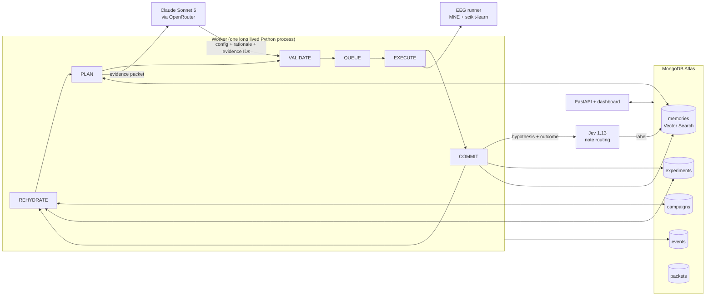

# Second Shift

**A research agent that can lose its working context, or its whole process, without losing its research campaign.**

Built today (September 26, 2026) at the MongoDB x Cerebral Valley Harness Engineering hackathon, Problem Statement 2: Long Horizon Engineering.

Long running agents forget why they ran old experiments, rerun work they already paid for, and keep optimizing against goals that changed hours ago. Second Shift keeps the campaign in MongoDB Atlas and rebuilds every decision from durable evidence, so the model's context window can be thrown away after each step.

The reference workload is a real one: classifying imagined movement (both fists vs both feet) from EEG recordings in PhysioNet's EEG Motor Movement/Imagery dataset.

## What it does

- **One campaign survives everything.** Goal, constraints, protocol, every experiment and its measured result live in Atlas. Kill the worker with `SIGKILL`, start a new one, and it picks up where the last one died.
- **The model picks, code measures.** Claude Sonnet 5 (through OpenRouter) chooses the next configuration from a fixed menu of 225 and cites evidence IDs. It never computes or reports a metric. Every number comes from the numerical runner and is stored in the experiment document.
- **Bounded context, rebuilt every step.** Each decision gets a fresh evidence packet: the latest goal, the best and worst results under the current constraints, every configuration already tried, pending jobs and a short recent window, all by exact MongoDB reads, plus a few notes ranked by Atlas Vector Search over Voyage embeddings. The packet has a token budget, and it is saved so you can see exactly what the model saw.
- **Goals can change mid campaign.** Drop the electrode budget from 64 to 9 and eligibility is recomputed from results already measured. Nothing is rerun and nothing comparable is thrown away.
- **A small decision model triages notes.** After each experiment, the planner's free text hypothesis plus a code computed outcome goes to Jev (`typesafe/jev-1.13` through OpenRouter's Decisions API). Jev labels it `research_note`, `failure_memory`, `ignore` or `review`. Useful notes become unverified memories that Vector Search can surface later. Jev never computes or compares numbers, and a Jev label never makes a note verified.
- **Work is never paid for twice.** Experiments are keyed by a hash of the effective configuration plus the protocol (data file hashes, exact splits, evaluator version, seed). A finished experiment is reused. A changed dataset or evaluator can never silently reuse old numbers.

## Measured today

All numbers below come from real runs against real PhysioNet data and our Atlas Sandbox cluster. Nothing is simulated except where labeled.

**A full LLM driven campaign** (`camp_0f8981ee`, budget 10 experiments, subjects 1 to 5):

- 10 planner decisions, 0 fallbacks, 0 proposals rejected by the code guards
- 30,341 provider reported input tokens, $0.085 total
- Validation balanced accuracy went 0.692, 0.571, 0.745, 0.665, 0.774, ...
- The planner noticed from measured results that 21 motor channels beat all 64 and narrowed its search accordingly
- Final pick: CSP + LDA, 13 to 30 Hz, 0.5 to 2.5 s window, 21 channels. **0.774 validation, 0.732 on the sealed test set** (75 trials, scored once)
- The planner stopped with 1 experiment unspent, arguing nearby variants were exhausted. That call is recorded with its rationale.

**Jev in the loop** (`camp_87e974bd`, full campaign): 10 of 10 notes routed by `typesafe/jev-1.13-20260917` (provider TypeSafe), 0 fallbacks, $0.000226 for all 10 calls. All 10 were labeled `research_note` and stored as unverified memories. The campaign used its whole budget and reached the same best result as the first run (0.774 validation, 0.732 sealed test). One of its 10 planner decisions hit OpenRouter's new account limit (20 requests per minute) and fell back; the worker now waits out rate limits instead. A separate 20 note smoke test of the Jev integration agreed with our hand labels on 19 of 20 and sent all 4 prompt injection style notes to `review`. That is a smoke test, not an accuracy estimate.

**Memory growth** (`eval/stress.json`): we copied the real campaign and buried it under synthetic distractor notes, all labeled `synthetic_stress`.

| Notes in memory | Search p50 | Search p95 | Evidence packet |
|---|---|---|---|
| 9 | 240 ms | 318 ms | 940 tokens |
| 1,009 | 261 ms | 310 ms | 780 tokens |
| 10,009 | 727 ms | 4,614 ms | 781 tokens (1,204 with the current packet) |

The packet stays far under its 4,000 token budget while memory grows by three orders of magnitude, and it always carries the best eligible result. One honest miss shaped the design: Vector Search never put the best result's note in its top 4, even with zero distractors, because embeddings cannot rank by a number. So numerical evidence (best result, top and bottom results, recent results) reaches the model by exact MongoDB reads, and Vector Search is used only for notes. Latency is end to end from a laptop, including the Voyage query embedding, on the free Sandbox tier.

**Recovery check** (`python -m eval.demo_checks recovery`, `camp_51b0f538`, real planner): **8 of 8 invariants passed.** The worker was SIGKILLed mid job after 2 finished experiments. A new process reported the resume, reused both finished experiments (each committed exactly once), waited out the dead lease, reran the orphaned job as attempt 2, finished the campaign and scored the sealed test set once (0.678).

**Constraint change check** (`python -m eval.demo_checks constraint`, `camp_66e4900c`, real planner): **5 of 5 invariants passed.** After 4 experiments the channel limit dropped from 64 to 9. Eligibility was recomputed with zero new runs, every later proposal used 9 channels, and the final pick respected the new goal: CSP + LDA on the central 9 channels, 0.759 validation, 0.719 sealed test.

Raw output for both is in `eval/checks.json`.

**Context comparison** (`python -m eval.run_ablation`, `eval/results.json`): 5 scenarios built from the real campaign, 2 context strategies, 3 repeats each, 30 real planner calls. Both strategies share the same planner, model, tools and code guards; only the packet differs. `recent_window` sees the goal, the tried list and the last 6 experiments. `evidence` adds exact reads of the best and worst results plus Vector Search over notes.

| | recent_window | evidence |
|---|---|---|
| Decisions that cited the scenario's key evidence | 9 of 15 | 12 of 15 |
| Decisions that cited forbidden evidence (obsolete protocol) | 0 | 0 |
| Eligible proposals | 15 of 15 | 15 of 15 |
| Fallbacks | 0 | 0 |
| Mean provider input tokens | 3,310 | 4,171 |
| Cost for 15 decisions | $0.137 | $0.163 |

The whole gap comes from one scenario. In `buried_best_eligible`, the best result allowed under the new 9 channel limit sat outside the recent window: `evidence` cited it 3 of 3 times, `recent_window` 0 of 3. The evidence reached the model through an exact read, not through Vector Search. In `buried_failure`, the evidence packet contained the buried bad result but the model cited it 0 of 3 times; neither strategy repeated that bad configuration family. The other three scenarios tied at 3 of 3. The evidence packet costs about 26% more input tokens. This is a demo scale check (n = 15 per strategy), not a benchmark.

An earlier run of this comparison is kept in `eval/results_run1_invalid.json` and does not count: the packet then listed tried experiments only as hashes, so the model re-proposed tried configurations and 15 of 30 decisions fell back. Fixing that is what made this run valid.

## How it works



- `harness/worker.py` runs the state loop. Between steps it holds no conversation history.
- `harness/context.py` builds the evidence packet under a token budget and stores it in `packets`.
- `harness/planner.py` calls the model with two tools (`propose_experiment`, `stop`), validates the answer in code, allows one repair, then falls back to a deterministic pick.
- `harness/store.py` owns durable state: atomic job claims with leases, commits fenced by lease token (a zombie worker cannot overwrite a newer attempt), dedup and reuse, and a sealed test set that can be scored only once.
- `harness/memory.py` embeds notes with Voyage and retrieves them with `$vectorSearch`, filtering by campaign, protocol and status before ranking.
- `harness/eeg.py` is the only place metrics are computed.

## The experiment

- **Data:** PhysioNet EEG Motor Movement/Imagery v1.0.0, runs 6, 10 and 14 (imagined both fists vs both feet), 64 channels at 160 Hz, subjects 1 to 5.
- **Protocol, fixed before any results were seen:** within subject. Each subject gets its own model trained on run 6 and scored on run 10. Run 14 stays sealed until the campaign finalizes. Predictions are pooled across subjects.
- **Menu:** 2 methods (log band power + logistic regression, CSP + shrinkage LDA) x 5 bands x 3 time windows x 3 channel sets x 2 or 3 method settings = 225 configurations.
- **Scope:** offline classification only. Zero phase filtering is offline, not a real time decoder. No clinical claims. Repeated use of the validation run is model selection, which is why the test run is sealed.

## Run it

```bash
python3 -m venv .venv && .venv/bin/pip install -r requirements.txt
cp .env.example .env          # MONGODB_URI, OPENROUTER_API_KEY, VOYAGE_API_KEY, DB_NAME=second_shift

.venv/bin/python -m harness.eeg --mode demo                     # real data gate: hashes, splits, sample results
.venv/bin/python -m harness.worker --new --mode demo --budget 10 # run a campaign
.venv/bin/uvicorn api.main:app --port 8000                      # dashboard at http://localhost:8000
.venv/bin/python -m eval.demo_checks all                        # recovery + constraint checks
.venv/bin/python -m pytest -q
```

The EEG files (about 39 MB for subjects 1 to 5) download from PhysioNet on first run.

## What we do not claim

- We did not run billions of tokens today. The campaign here is small on purpose. What we show is the mechanism that keeps context bounded as history grows, plus a measured check with synthetic distractor notes (labeled `synthetic_stress` and kept out of all result summaries).
- Checkpointing is not new (LangGraph has it). What we add is verified result memory, evidence packets with provenance, constraint aware reuse, and fenced recovery for a numerical research loop.
- A job killed mid computation is rerun as a new attempt. We do not claim mid training checkpoints or exactly once execution of external computation.
- Accuracy numbers are from 5 subjects and 75 validation trials. They show the loop works on real data, not population level performance.

## Attribution

EEG data: Schalk G., McFarland D.J., Hinterberger T., Birbaumer N., Wolpaw J.R. (2004). BCI2000: A General-Purpose Brain-Computer Interface (BCI) System. IEEE Transactions on Biomedical Engineering 51(6):1034 to 1043. Distributed by PhysioNet (DOI 10.13026/C28G6P) under the Open Data Commons Attribution License. Full credits, including MNE-Python, scikit-learn, Voyage AI, OpenRouter and MongoDB Atlas, are in `docs/ATTRIBUTION.md`.

The harness, EEG adapter, tests and dashboard in this repository are our original work from today.

## Team

Andrew Shatsky and David Shatsky.
